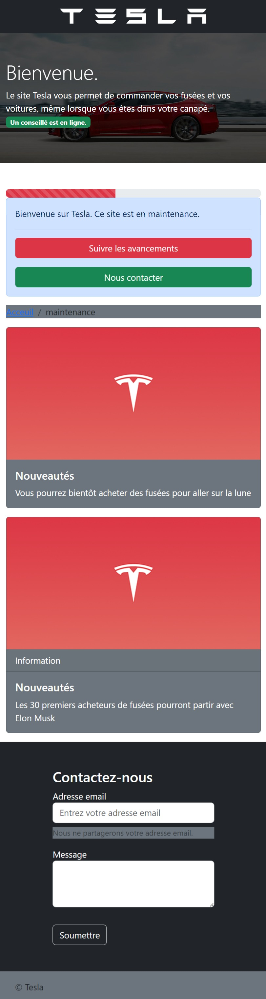

Section 7 : Projet - Le site de Tesla
===

## Information
- Title:  `Projet - Le site de Tesla`
- Authors:  `Etienne KOA`

## Etape 1 : l'entête

+ Dans cette première étape, je vous conseils vivement de vous focaliser sur l’entête de notre site.

+ Petite astuce : utilisez les paddings pour aérer votre texte ;)

## Etape 2 : le bandeau

+ Dans cette deuxième étape, je vous conseils de vous mettre sur la bannière.

## Etape 3 : la première section

+ Dans cette troisième étape, il est temps pour vous d’attaquer la première section !

+ Les deux boutons sont collés ensemble grâce à la classe `.btn-group` sur un `div` parent qui englobe les deux boutons.

## Etape 4 : la deuxième section

+ Dans cette quatrième étape, vous allez devoir vous consacrer à la deuxième section.

+ Les cartes ne seront pas toutes les deux côtes à côtes. 

## Etape 5 : la troisième section

+ Plus que deux étapes : vous allez maintenant vous consacrer à la troisième section !

+ Il s’agit surement de la partie que vous appréhendez le plus, mais restez simple, nous avons tout ce qu’il faut pour que vous puissiez parvenir à ce résultat.

## Etape 6 : le pied de page

+ Dernière étape pour ce projet ! Allez, encore un petit effort !

+ Il s’agit de la partie la plus simple de ce projet : le pied de page.

## Projet Final

