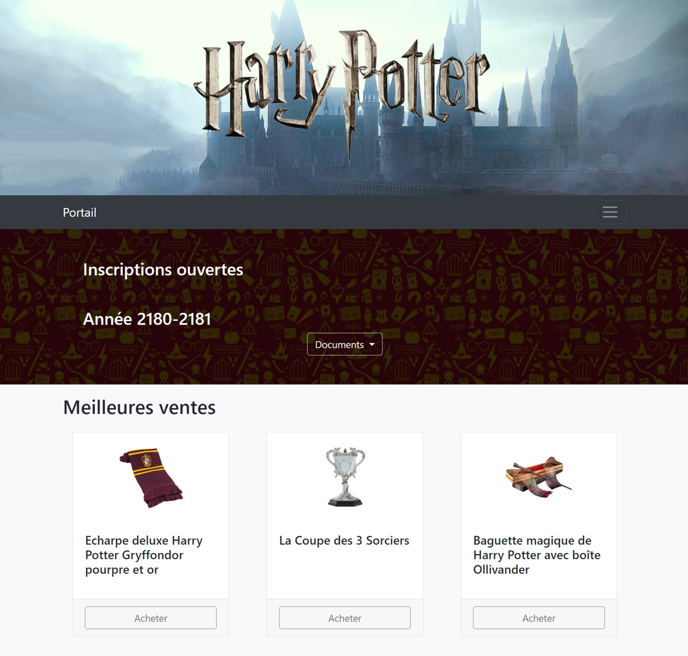

Section 12 : Projet - Le site d'Harry Potter
===

## Information
- Title:  `Projet - Le site d'Harry Potter`
- Authors:  `Etienne KOA`

## Etape 1 : l'entête

+ Pour cette première étape, je vous invite grandement à commencer par l'entête. 

## Etape 2 : la barre de navigation

+ Pour cette deuxième étape, vous pouvez vous attaquer à la barre de navigation. Attention, il s'agit d'un des plus gros morceaux de ce projet.

+ Concernant la barre de navigation, pensez à utiliser la classe `.navbar-expand-md` dans votre balise `nav`. Cette classe permet de définir sur quelle largeur Bootstrap doit afficher la liste déroulante (vous comprenez donc pourquoi on précise la taille `md`).

## Etape 3 : le bandeau

+ Dans cette troisième étape, je vous encourage à vous attaquer au bandeau. Pensez bien à faire le `dropdown` (bouton à liste déroulante). 

## Etape 4 : les meilleures ventes

+ Attention, vous allez attaquer le morceau le plus dur de ce projet !

+ Ici : pensez à utiliser une grille. Et n'oubliez pas que chaque bouton a pour objectif d'ouvrir une fenêtre popup !

+ De plus, chaque fenêtre dispose d'une image qui fait 100% en largeur, et le bouton "Ajouter au panier" doit être non fonctionnel, une infobulle devant apparaître pour dire que l'article n'est plus disponible.

## Etape 5 : le pied de page

+ Dernière étape : la plus simple ! Le pied de page. 

## Projet Final

