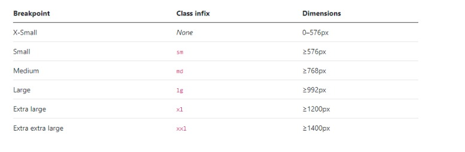

Recapitulatif
===

## Information
- Title:  `Recapitulatif`
- Authors:  `Etienne KOA`


## Les bases de Bootstrap (Section 2)


#### 1) Ajouter des couleurs

```
<p class="text-primary">.text-primary</p>
<p class="text-secondary">.text-secondary</p>
<p class="text-success">.text-success</p>
<p class="text-danger">.text-danger</p>
<p class="text-warning bg-dark">.text-warning</p>
<p class="text-info bg-dark">.text-info</p>
<p class="text-light bg-dark">.text-light</p>
<p class="text-dark">.text-dark</p>
<p class="text-body">.text-body</p>
<p class="text-muted">.text-muted</p>
<p class="text-white">.text-white</p>
```

#### 2) Ajouter une couleur de background

```
<div class="bg-primary">.bg-primary</div>
<div class="bg-secondary">.bg-secondary</div>
<div class="bg-success">.bg-success</div>
<div class="bg-danger">.bg-danger</div>
<div class="bg-warning">.bg-warning</div>
<div class="bg-info">.bg-info</div>
<div class="bg-light">.bg-light</div>
<div class="bg-dark">.bg-dark</div>
<div class="bg-white">.bg-white</div>
<div class="bg-transparent">.bg-transparent</div>
```

#### 3) Gérer les dimensions

```
<div class="w-25"></div>
<div class="w-50"></div>
<div class="w-75"></div>
<div class="w-100"></div>
 
<!-- Pareil avec height -->
 
<div class="h-..."></div>
 
<div class="vh-100"></div>
<div class="vw-100"></div>
 
<div class="min-vh-100"></div>
<div class="min-vw-100"></div>
```

## Notions Intermediaires (Section 3)

#### 1) Les "breakpoints"

```

```


#### 2) Aligner du texte

```
<div class="text-start"></div>
<div class="text-center"></div>
<div class="text-end"></div>
 
<div class="text-md-center text-sm-end text-center"></div>
```

#### 3) Transformer du texte


```
<p class="text-lowercase">tout est en minuscule.</p>
<p class="text-uppercase">TOUT EST EN MAJUSCULE.</p>
<p class="text-capitalize">Tout Nouveau Mot Commence Par Une Majuscule.</p>
```

#### 4) Gérer le text-decoration

```
<a class="text-decoration-line-through">Texte barré</a>
<a class="text-decoration-underline">Texte souligné</a>
<a class="text-decoration-none">Texte sans surlignement</a>
```

#### 5) Mettre en forme

```
<p class="fw-bold">Texte en gras.</p>
<p class="fw-bolder">Texte très gras.</p>
<p class="fw-normal">Texte sans gras.</p>
<p class="fw-light">Texte léger.</p>
<p class="fw-lighter">Texte très léger.</p>
<p class="fst-italic">Texte en italique.</p>
<p class="fst-normal">Texte sans italique.</p>
```

#### 6) Gérer les polices


```
<p class="h1">Titre principal</p> <!-- h1, h2, h3, ... h6 -->
<h1 class="display-1">Titre principal</h1> <!-- display-1 ... display-6 -->
  
<!-- Pour les descriptions --> 
<p class="lead">
    Vivamus sagittis lacus vel augue laoreet rutrum faucibus dolor auctor. Duis mollis, est non commodo luctus.
</p>
```

#### 7) Gérer les ombres

```
<div class="shadow-none">Aucune ombre ici.</div>
<div class="shadow-sm">Petite ombre légère.</div>
<div class="shadow">Ombre par défaut</div>
<div class="shadow-lg">Ombre plutôt large</div>
```

#### 8) Gérer les bordures

```
<span class="border"></span>
<span class="border-top"></span>
<span class="border-end"></span>
<span class="border-bottom"></span>
<span class="border-start"></span>
 
<span class="border-0"></span>
<span class="border-top-0"></span>
<span class="border-end-0"></span>
<span class="border-bottom-0"></span>
<span class="border-start-0"></span>
 
<span class="border border-primary"></span>
<span class="border border-secondary"></span>
<span class="border border-success"></span>
<span class="border border-danger"></span>
<span class="border border-warning"></span>
<span class="border border-info"></span>
<span class="border border-light"></span>
<span class="border border-dark"></span>
<span class="border border-white"></span>
```

#### 9) Gérer les bordures arrondies

```


 


```

#### 10) Gérer les positions / flottants


```
<div class="position-static">...</div>
<div class="position-relative">...</div>
<div class="position-absolute">...</div>
<div class="position-fixed">...</div>
<div class="position-sticky">...</div>
 
<div class="float-start">...</div>
<div class="float-end">...</div>
<div class="float-none">...</div>
 
<div class="float-md-end">...</div> <!-- Sera aligné en tant que flottant, à droite, jusqu'au breakpoint md -->
```

#### 11) Rendre les iframes responsive


```
<div class="ratio ratio-16x9">
    <iframe allowfullscreen src="https://www.youtube.com/embed/lXgLyCYuYA4"></iframe>
</div>
 
<!-- 
    Formats
        - ratio-1x1
        - ratio-16x9
        - ratio-4x3
        - ratio-21x9
-->
```

#### 12) Permettre la sélection

```
<p class="user-select-all">Le paragraphe sera sélectionné quand cliqué par l'utilisateur.</p>
<p class="user-select-auto">Le paragraphe a un comportement normal.</p>
<p class="user-select-none">Le paragraphe n'est pas sélectionnable.</p>
```

## Les tableaux


#### 1) Initialiser un tableau

```
<table class="table">
    ...
</table>
```

#### 2) Mettre en couleur


```
<!-- Sur le tableau -->
<table class="table-primary">...</table>
<table class="table-secondary">...</table>
<table class="table-success">...</table>
<table class="table-danger">...</table>
<table class="table-warning">...</table>
<table class="table-info">...</table>
<table class="table-light">...</table>
<table class="table-dark">...</table>
 
<!-- Sur des lignes -->
<tr class="table-primary">...</tr>
<tr class="table-secondary">...</tr>
<tr class="table-success">...</tr>
<tr class="table-danger">...</tr>
<tr class="table-warning">...</tr>
<tr class="table-info">...</tr>
<tr class="table-light">...</tr>
<tr class="table-dark">...</tr>
 
<!-- Sur des cellules (`td` ou `th`) -->
<tr>
  <td class="table-primary">...</td>
  <td class="table-secondary">...</td>
  <td class="table-success">...</td>
  <td class="table-danger">...</td>
  <td class="table-warning">...</td>
  <td class="table-info">...</td>
  <td class="table-light">...</td>
  <td class="table-dark">...</td>
</tr>
```

#### 3) Dissocier les lignes

```
<table class="table table-striped table-hover">
    ...
</table>
 
<!-- Et pour mettre en valeur :  -->
<tr>
    <td class="table-active">Anabelle</td>
    <td>Dupont</td>
    <td>45 ans</td>
</tr>
```

#### 4) Gérer les bordures


```
<table class="table table-bordered border-primary">
 
</table>
 
<!-- Pour retirer les bordures -->
<table class="table table-borderless">
 
</div>
```

#### 5) Faire de petits tableaux

```
<table class="table table-sm">
    ...
</table>
```

#### 6) Aligner verticalement les items

+ Il suffit d'utiliser la classe `align-middle` ou `align-bottom` sur la ligne ou sur la cellule du tableau.


#### 7) Faire un tableau totalement responsive

```
<table class="table table-responsive">
 
</table>
 
<!-- En utilisant les breakpoints -->
<table class="table table-responsive-lg">
 
</table>
```

#### 8) Ajouter une description

```
<table class="table">
    <caption>Description</caption>
    ...
</table>
 
<!-- Et si on veut mettre la description au-dessus du tableau -->
<table class="table caption-top">
    <caption>Description</caption>
    ...
</table>
```

## Les composants CSS


#### 1) Les boutons

```
<div class="btn-group-vertical">
    <button class="btn btn-primary">Bouton principal</button>
    <button class="btn btn-outline-primary">Bouton secondaire</button>
</div>
<button class="btn btn-primary btn-block" disabled>Lien</button>
```

#### 2) Les alertes

```
<div class="alert alert-info">
    <h3 class="alert-heading">Bienvenue !</h3>
    Ceci est une notification et ceci un <a href="#" class="alert-link">lien</a>
</div>
```

#### 3) Les barres de navigation

```
<nav class="navbar navbar-dark bg-dark navbar-expand">
    <div class="container">
        <div class="navbar-brand">
            Smoosh
        </div>
 
        <div class="collapse navbar-collapse">
            <ul class="navbar-nav">
                <li class="nav-item">
                    <a href="#" class="nav-link active">Accueil</a>
                </li>
                <li class="nav-item">
                    <a href="#" class="nav-link">Contact</a>
                 </li>
             </ul>
        </div>
    </div>
</nav>
```

#### 4) Les badges

```
<h3>Les meilleurs restaurants de Paris <span class="badge bg-secondary">New</span></h3>
<button type="button" class="btn btn-primary">
    Demandes d'ami <span class="badge bg-dark">5</span>
</button>
```

#### 5) Les formulaires

```
<form class="mt-5">
    <p>
        <label for="prenom" class="form-label">Prénom</label>
        <input type="text" name="prenom" id="prenom" class="form-control">
    </p>
 
    <p>
        <label for="pays" class="form-label">Pays</label>
        <select name="pays" id="pays" class="form-select">
            <option value="France">France</option>
            <option value="Suisse">Suisse</option>
            <option value="Congo">Congo</option>
        </select>
    </p>
 
    <p>
        <input type="file" name="fichier" class="form-control">
    </p>
 
    <p>
        <label for="email" class="form-label">Adresse email</label>
        <input type="email" name="email" id="email" readonly value="john@gmail.com" class="form-control-plaintext">
    </p>
 
    <p class="form-check">
        <input type="checkbox" name="mode_sombre" class="form-check-input" id="mode_sombre">
        <label for="mode_sombre" class="form-check-label">Mode sombre</label>
    </p>
 
    <p class="form-check form-switch">
        <input type="checkbox" name="mode_sombre" class="form-check-input" id="mode_sombre_pour_switch">
        <label for="mode_sombre_pour_switch" class="form-check-label">Mode sombre</label>
    </p>
</form>
```

#### 6) Regrouper ses champs de formulaire

```
<p>
    <label for="email" class="form-label">Adresse email</label>
    <div class="input-group">
        <span class="input-group-text">
            https://www.youtube.com/watch?v=
        </span>
        <input type="email" name="email" id="email" class="form-control">
    </div>
</p>
 
<p>
    <div class="input-group">
        <span class="input-group-text">
            Vos motivations ?
        </span>
        <textarea class="form-control"></textarea>
    </div>
</p>
```

#### 7) Les cartes

```
<div class="card">
    <!-- Image d'illustration -->
    
 
    <!-- En-tête de la carte -->
    <div class="card-header">
        Destination
    </div>
 
    <!-- Corps -->
    <div class="card-body">
        <h5 class="card-title">Titre</h5>
        <h6 class="card-subtitle text-muted">Destination</h6>
        <p class="card-text">Ceci est un exemple de carte
            que Bootstrap nous permet de créer.
        </p>
        <a href="#" class="card-link">En savoir plus</a>
        <a href="#" class="card-link">Réserver</a>
    </div>
 
    <!-- Pied -->
    <div class="card-footer p-0">
        <ul class="list-group list-group-flush">
            <li class="list-group-item">Visiter les pyrénées</li>
            <li class="list-group-item">Visiter le jura</li>
        </ul>
    </div>
</div>
```

#### 8) Les barres de progression

```
<div class="progress">
    <div class="progress-bar w-25">25%</div>
</div>
 
<div class="progress mt-1">
    <div class="progress-bar w-25">25%</div>
    <div class="progress-bar bg-success w-50">50%</div>
</div>
 
<div class="progress mt-1">
    <div class="progress-bar progress-bar-striped progress-bar-animated bg-dark w-75">25%</div>
</div>
```

#### 9) Les fils d'ariana

```
<nav>
    <ul class="breadcrumb">
        <li class="breadcrumb-item">
            <a href="#">Accueil</a>
        </li>
        <li class="breadcrumb-item">
            <a href="#">Destination</a>
        </li>
        <li class="breadcrumb-item">
            <a href="#">Les pyrénées</a>
        </li>
    </ul>
</nav>
```

## Les grilles


#### 1) Créer une grille

```
<!-- Dans la grille ci-dessous les deux éléments finissent par être l'un en-dessous de l'autre -->
<div class="row">
    <div class="col-md-4 col-sm-6">
        <div class="bg-danger p-4"></div>
    </div>
    <div class="col-md-4 col-sm-6">
        <div class="bg-info p-4"></div>
    </div>
</div>
 
<!-- Dans la grille ci-dessous l'élément prend toute la largeur -->
<div class="row">
    <div class="col">
        <div class="bg-secondary p-4"></div>
    </div>
</div>
```

#### 2) Prioriser nos éléments

+ On utilise pour ça la classe `.order-` suivi de la position que l'on veut donner à notre élément. Cette classe s'utilise sur la colonne. On peut également utiliser les breakpoints pour dire à un élément sa position en fonction de la taille du navigateur.


+ Décaler d'un certains nombre

  + On peut décaler d'un certains nombre de colonnes nos éléments vers la droite. Pour ça nous utilisons la classe `.offset-` suivi de 1 à 11 en fonction du nombre de colonnes que nous voulons. On peut également utiliser les breakpoints pour dire à un élément le nombre de colonnes qu'il décalera en fonction de la taille du navigateur.


+ Espacer les éléments

  + Pour espacer, nous allons utiliser ce que nous appelons des gouttières. On peut les utiliser de trois manières différentes :

    + `g-` - Pour un espacement de toutes les côtés

    + `gx-` - Pour un espacement du côté gauche et droite (horizontal)

    + `gy-` - Pour un espacement du côté haut et bas (vertical)

+ On associe ensuite un nombre entre 0 à 5 (aucun espace avec 0, énormément avec 5).


+ Aligner verticalement

  + Nous pouvons utiliser la classe `.align-self-center` et `.align-self-end` sur les colonnes que nous voulons aligner verticalement. Si nous souhaitons aligner tous les éléments d'une ligne au centre, nous pouvons utiliser `.align-items-center` et `.align-items-end` sur la classe `.row`.


## Les composants d'animation

#### 1) Les barres de navigation responsives

```
<nav class="navbar navbar-dark bg-dark navbar-expand-md">
    <div class="container">
        <div class="navbar-brand">
            Smoosh
        </div>
        <!-- Le bouton s'affichera en petit écran -->
        <button class="navbar-toggler" data-bs-toggle="collapse" data-bs-target="#monMenuDeroulant">
            <span class="navbar-toggler-icon"></span>
        </button>
 
        <div class="collapse navbar-collapse" id="monMenuDeroulant">
            <ul class="navbar-nav">
                <li class="nav-item">
                    <a href="#" class="nav-link active">Accueil</a>
                </li>
                <li class="nav-item">
                    <a href="#" class="nav-link">Contact</a>
                    </li>
                </ul>
        </div>
    </div>
</nav>
```

#### 2) Les carrousels

```
<!-- Créer un carousel -->
<div id="monPetitCarrousel" class="carousel slide carousel-fade" data-bs-ride="carousel">
 
    <!-- Indicateurs -->
    <ul class="carousel-indicators">
        <li data-bs-target="#monPetitCarrousel" data-bs-slide-to="0" class="active"></li>
        <li data-bs-target="#monPetitCarrousel" data-bs-slide-to="1"></li>
    </ul>
 
    <!-- Contenu du carousel -->
    <div class="carousel-inner">
 
        <!-- Premier slide -->
        <div class="carousel-item active" data-bs-interval="1000">
            
            
            <!-- Description -->
            <div class="carousel-caption">
                <h5>Le printemps arrive !</h5>
                <p>Les fleurs de cerisiers éclosent dans tout le Japon.</p>
            </div>
        </div>
 
        <!-- Deuxième slide -->
        <div class="carousel-item">
            
            
            <!-- Description -->
        </div>
 
    </div>
 
    <!-- Controles -->
    <a class="carousel-control-prev" href="#monPetitCarrousel" data-bs-slide="prev">
        <span class="carousel-control-prev-icon"></span>
        <span class="sr-only">Précédent</span>
    </a>
    <a class="carousel-control-next" href="#monPetitCarrousel" data-bs-slide="next">
        <span class="carousel-control-next-icon"></span>
        <span class="sr-only">Suivant</span>
    </a>
    
</div>
```

#### 3) Les listes déroulantes

```
<!-- Dropdown (liste déroulante) -->
<div class="dropdown m-3">
    <!-- Bouton -->
    <button id="monBoutonBleu" class="btn btn-primary dropdown-toggle" type="button" data-bs-toggle="dropdown">
        Je suis un menu
    </button>
 
    <!-- Les éléments du menu -->
    <ul class="dropdown-menu" aria-labbeledby="monBoutonBleu">
        <li><a class="dropdown-item" href="#">Action</a></li>
        <li><a class="dropdown-item" href="#">Action</a></li>
        <li><a class="dropdown-item" href="#">Action</a></li>
    </ul>
</div>
 
<!-- Liste déroulant et bouton collés -->
<div class="btn-group m-3 dropup">
    <button type="button" class="btn btn-primary">J'aime</button>
    <button type="button" class="btn btn-primary dropdown-toggle dropdown-toggle-split" data-bs-toggle="dropdown" id="mesOptions">
        <span class="sr-only">Options</span>
    </button>
    <ul class="dropdown-menu" aria-labbeledby="mesOptions">
        <li><a class="dropdown-item" href="#">Action</a></li>
        <li><a class="dropdown-item" href="#">Action</a></li>
        <li><a class="dropdown-item" href="#">Action</a></li>
    </ul>
</div>
```

#### 4) Les fenêtres modales

```
<!-- Modale -->
<button type="button" class="btn btn-danger" data-bs-toggle="modal" data-bs-target="#supprimer">
    Supprimer mon compte
</button>
 
<div class="modal fade" id="supprimer" data-bs-backdrop="static">
    <div class="modal-dialog modal-dialog-centered">
        <div class="modal-content">
 
            <!-- Header -->
            <div class="modal-header">
                <h5 class="modal-title">Supprimer mon compte</h5>
                <button type="button" class="btn-close" data-bs-dismiss="modal">
                    <span>&times;</span>
                </button>
            </div>
 
            <!-- Body -->
            <div class="modal-body">
                <p class="m-0">Etes-vous sûr de vous ? C'est très dangereux.</p>
            </div>
 
            <!-- Footer -->
            <div class="modal-footer">
                <button type="button" class="btn btn-outline-secondary" data-bs-dismiss="modal">Fermer</button>
                <button type="button" class="btn btn-danger">Supprimer</button>
            </div>
 
        </div>
    </div>
</div>
```

#### 5) Les infobulles

```
<button type="button" class="btn btn-info" data-bs-toggle="tooltip" data-bs-placement="bottom" title="Ma première infobulle">
    Action
</button>
 
<script>
    var tooltipTriggerList = [].slice.call(document.querySelectorAll('[data-bs-toggle="tooltip"]'))
    var tooltipList = tooltipTriggerList.map(function (tooltipTriggerEl) {
        return new bootstrap.Tooltip(tooltipTriggerEl)
    })
</script>
```

#### 6) Les popovers

```
<button type="button" class="btn btn-secondary" data-bs-toggle="popover" data-bs-placement="bottom" data-bs-content="Fonctionnalité non créée">
    Fonctionnalité
</button>
 
<script>
    var popoverTriggerList = [].slice.call(document.querySelectorAll('[data-bs-toggle="popover"]'))
    var popoverList = popoverTriggerList.map(function (popoverTriggerEl) {
        return new bootstrap.Popover(popoverTriggerEl)
    })
</script>
```

#### 7) Les "Scrollspy"

+ Pour espionner le scroll des utilisateurs, nous avons besoin d'ajouter l'attribut `data-bs-spy` et `data-bs-target` sur la balise `body`.

```
<body data-bs-spy="scroll" data-bs-target="#menu">
 
</body>
```

+ La cible doit toujours être une balise nav qui utilise la classe `navbar`. Il ne reste qu'à ajouter vos ancres et Bootstrap gérera tout.


#### 8) Les spinners

```
<!-- Démonstration A -->
<div class="spinner-border text-primary">
    <span class="visually-hidden">Chargement</span>
</div>
 
<!-- Démonstration B -->
<div class="spinner-grow text-primary">
    <span class="visually-hidden">Chargement</span>
</div>
 
<!-- Démonstration C -->
<button type="button" class="btn btn-primary">
    Modifier
    <span class="spinner-border spinner-border-sm"></span>
</button>

```
## Flexbox et Bootstrap


#### 1) Utiliser Flexbox

```
<div class="d-flex">
 
</div>
```

#### 2) Donner une direction

```
<div class="d-flex flex-row">
 
</div>
 
<!--
    On a également
    
    - flex-row-reverse
    - flex-column
    - flex-column-reverse
-->
```

#### 3)Aligner les éléments

+ On peut utiliser la propriété justify-content: start avec la classe `.justify-content-start` sur le container `(.d-flex)`. Toutes les valeurs sont acceptées : `end, center, between, around, evenly`.

+ Nous pouvons utiliser aussi la propriété `align-items`: center avec la classe `.align-items-center` et il en est de même avec `.align-self-center` si nous voulons centrer non pas tous les éléments mais un seul élément. Toutes les valeurs sont acceptées : `start, end, baseline, stretch`.


#### 4) Donner des proportions identiques

+ Il est possible de donner des proportions identiques, comme avec` flex-grow: 1` grâce à la classe `.flex-grow-1`.


#### 5) Wrapper des éléments

+ Pour wrapper des éléments, on peut utiliser `.flex-wrap` ou `.flex-wrap-reverse`. La classe `.flex-nowrap` vient annuler l'effet.


#### 6) Désigner un ordre

+ On peut désigner un ordre avec la classe `.order-` qui va de 1 à 5.