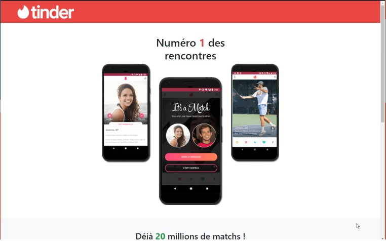

Section 5 : Projet - Un clone de Tinder

## Information
- Title:  `Section 5 : Projet - Un clone de Tinder`
- Authors:  `Etienne`

## Voici ce que nous allons réaliser

## Etape 1 : l'entête

+ Dans ce projet, nous allons y aller étape par étape. Je vais vous laisser tout faire, de A à Z, mais je souhaite tout de même vous accompagner pour ce premier projet sur Bootstrap.

+ Ainsi, pour notre première étape, attardons-nous à refaire notre entête.

## Etape 2 : la première section

+ Dans cette deuxième étape, je vous invite à vous pencher sur la première section, c'est-à-dire cette partie :

## Etape 3 : la deuxième section

+ Nous avons bientôt fini ! Dans cette troisième étape, je vous invite grandement à vous occuper de la deuxième section.

+ Pensez bien à redimensionner la vidéo YouTube comme nous avons appris à le faire.

## Etape 4 : le pied de page

+ Dernière étape : le pied de page !

+ Pensez bien à reprendre la même couleur que pour l'entête... On se revoit pour la correction !

